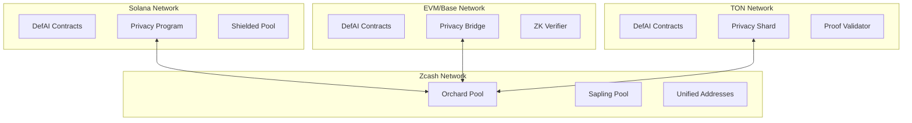

# DefAI Cross-Chain Privacy Implementation with Zcash Technology

## Executive Summary
This document outlines the comprehensive implementation strategy for integrating Zcash privacy technology across the DefAI ecosystem, spanning multiple blockchain networks (Solana, EVM/Base, TON) to provide enhanced privacy features for DeFi operations, estate management, app distribution, and staking mechanisms.

## Current Multi-Chain Architecture

### Deployed Chains & Contracts
- **Solana Network**:
  - DefAI Swap (AMM with tier-based bonuses and VRF integration)
  - DefAI Estate (Estate management with RWA tokenization)
  - DefAI Staking (Tiered staking: Gold, Titanium, Infinite)
  - DefAI App Factory (Decentralized app marketplace)

- **EVM/Base Network**:
  - DefAI Staking (Upgradeable contracts with escrow rewards)
  - DefAI App Factory (ERC-1967 upgradeable pattern)
  - DefAI Estate (Minimal implementation)

- **TON Blockchain**:
  - DefAI Swap (FunC implementation with sharding support)
  - DefAI App Factory (FunC with review system)
  - DefAI Estate (TON-specific estate management)

### Key Privacy Requirements by Chain

#### Solana-Specific Requirements
1. Private swap transactions with hidden tier bonuses
2. Shielded VRF randomness for fair distribution
3. Anonymous estate beneficiaries with encrypted allocations
4. Private staking positions and reward calculations
5. Hidden app purchase history and review attribution

#### EVM/Base-Specific Requirements
1. Private upgradeable proxy interactions
2. Shielded escrow balance management
3. Anonymous cross-contract calls
4. Private timelock operations
5. Hidden multi-sig approvals

#### TON-Specific Requirements
1. Private message routing between shards
2. Shielded workchain interactions
3. Anonymous bounced message handling
4. Private storage cell encryption
5. Hidden masterchain validation

## Multi-Chain Privacy Implementation Strategy

### Architecture: Universal Cross-Chain Privacy Layer

```
┌──────────────────────────────────────────────────────┐
│              Frontend & SDK Layer                    │
│  ┌────────────┬─────────────┬─────────────┐        │
│  │  Next.js   │  Anchor SDK │  TON SDK    │        │
│  └────────────┴─────────────┴─────────────┘        │
├──────────────────────────────────────────────────────┤
│            Privacy Abstraction Layer                 │
│  ┌────────────┬─────────────┬─────────────┐        │
│  │ WebZjs SDK │  ZK-SNARKs  │  Halo2      │        │
│  └────────────┴─────────────┴─────────────┘        │
├──────────────────────────────────────────────────────┤
│           Cross-Chain Bridge Layer                   │
│  ┌────────────┬─────────────┬─────────────┐        │
│  │  Solana    │  EVM/Base   │     TON     │        │
│  └────────────┴─────────────┴─────────────┘        │
├──────────────────────────────────────────────────────┤
│              Zcash Privacy Network                   │
│  ┌────────────────────────────────────────┐        │
│  │    Shielded Pool & Orchard Protocol    │        │
│  └────────────────────────────────────────┘        │
└──────────────────────────────────────────────────────┘
```

## Implementation Options

### Option 1: ChainSafe WebZjs Integration (Recommended)

**Advantages:**
- Full Zcash wallet functionality in browser
- Supports both transparent and shielded addresses
- Active development and maintenance
- TypeScript native support

**Installation:**
```bash
npm install @chainsafe/webzjs-wallet
npm install @chainsafe/webzjs-core
```

**Basic Implementation:**
```typescript
// src/services/zcashPrivacyService.ts
import { WebZWallet, initThreadPool } from '@chainsafe/webzjs-wallet';

export class ZcashPrivacyService {
  private wallet: WebZWallet;
  
  async initialize() {
    await initThreadPool();
    this.wallet = await WebZWallet.create({
      network: 'mainnet',
      endpoint: process.env.NEXT_PUBLIC_LIGHTWALLETD_ENDPOINT
    });
  }
  
  async createShieldedAddress() {
    return await this.wallet.createAccount();
  }
  
  async shieldTransaction(amount: bigint, memo?: string) {
    return await this.wallet.shield({
      amount,
      memo,
      fee: 10000n
    });
  }
}
```

### Option 2: Zero-Knowledge Proof Layer

**Use Halo2 for selective privacy:**
```typescript
// src/lib/zkProofs.ts
export interface ZKProof {
  proof: Uint8Array;
  publicInputs: string[];
}

export async function generateEstateProof(
  estateValue: bigint,
  beneficiaryCount: number
): Promise<ZKProof> {
  // Generate ZK proof without revealing actual values
}
```

## Chain-Specific Privacy Implementations

### 1. Solana Privacy Features

```rust
// defai_swap/src/privacy.rs
use anchor_lang::prelude::*;
use zcash_primitives::sapling::{PaymentAddress, Note};

#[account]
pub struct ShieldedSwap {
    pub commitment: [u8; 32],  // Note commitment
    pub nullifier: [u8; 32],   // Spend nullifier
    pub encrypted_tier: Vec<u8>, // Encrypted tier info
    pub proof: Vec<u8>,        // ZK-SNARK proof
}

// Private tier bonus calculation
pub fn shield_tier_bonus(
    tier: u8,
    bonus_bps: u16,
    viewing_key: &[u8; 32]
) -> Result<ShieldedTierData> {
    // Generate shielded note for tier bonus
    // Encrypt bonus information
    // Return commitment and proof
}
```

### 2. EVM/Base Privacy Features

```solidity
// contracts/privacy/ZcashBridge.sol
contract ZcashPrivacyBridge {
    using Pairing for *;
    
    struct ShieldedStake {
        bytes32 commitment;
        bytes32 nullifierHash;
        uint256 encryptedAmount;
        bytes zkProof;
    }
    
    mapping(bytes32 => ShieldedStake) private shieldedStakes;
    
    function shieldStake(
        uint256 amount,
        bytes32 commitment,
        bytes calldata proof
    ) external {
        // Verify ZK proof
        // Create shielded position
        // Update merkle tree
    }
}
```

### 3. TON Privacy Features

```func
;; defai_privacy.fc
#include "imports/stdlib.fc";

;; Shielded transaction structure
;; commitment#_ nullifier:bits256 encrypted_data:^Cell proof:^Cell = ShieldedTx;

() process_shielded_transaction(slice sender, int amount, cell proof) impure {
    ;; Verify ZK-SNARK proof
    var (valid, commitment) = verify_groth16_proof(proof);
    throw_unless(error::invalid_proof, valid);
    
    ;; Store shielded note
    var shielded_data = begin_cell()
        .store_uint(commitment, 256)
        .store_ref(proof)
        .end_cell();
    
    ;; Update merkle tree
    update_privacy_merkle_tree(shielded_data);
}
```

## Implementation Phases

### Phase 1: Chain-Specific Privacy Foundation (Weeks 1-4)
- [ ] **Solana**: Integrate Zcash Rust libraries with Anchor framework
- [ ] **EVM**: Deploy ZK-SNARK verifier contracts on Base
- [ ] **TON**: Implement Groth16 proof verification in FunC
- [ ] Set up cross-chain LightwalletD infrastructure
- [ ] Create unified privacy SDK for all chains

### Phase 2: Contract-Specific Privacy Integration (Weeks 5-10)

#### DefAI Swap Privacy
- [ ] Private swap routing with hidden slippage
- [ ] Shielded tier bonus calculations
- [ ] Anonymous VRF participation
- [ ] Encrypted liquidity positions

#### DefAI Estate Privacy
- [ ] Shielded beneficiary management across chains
- [ ] Private RWA tokenization
- [ ] Encrypted document storage with IPFS
- [ ] Zero-knowledge inheritance claims

#### DefAI Staking Privacy
- [ ] Hidden staking positions (Gold/Titanium/Infinite)
- [ ] Private reward accumulation
- [ ] Anonymous escrow distributions
- [ ] Shielded tier transitions

#### DefAI App Factory Privacy
- [ ] Anonymous app purchases
- [ ] Private review submissions
- [ ] Shielded revenue sharing
- [ ] Encrypted metadata storage

### Phase 3: Cross-Chain Privacy Bridge (Weeks 11-16)
- [ ] Implement Zcash↔Solana privacy bridge
- [ ] Deploy Base↔Zcash shielded bridge
- [ ] Create TON↔Zcash message passing
- [ ] Unified privacy wallet interface
- [ ] Cross-chain viewing keys management

## Technical Requirements

### Dependencies by Chain

#### Solana Dependencies
```toml
# Cargo.toml additions
[dependencies]
zcash_primitives = "0.13"
zcash_proofs = "0.13"
bellman = "0.14"
bls12_381 = "0.8"
jubjub = "0.10"
```

#### EVM/Base Dependencies
```json
{
  "dependencies": {
    "@chainsafe/webzjs-wallet": "^1.0.0",
    "@chainsafe/webzjs-core": "^1.0.0",
    "snarkjs": "^0.7.0",
    "circomlib": "^2.0.5",
    "@zk-kit/protocols": "^2.0.0"
  }
}
```

#### TON Dependencies
```func
;; Import ZK verification libraries
#include "crypto/groth16.fc"
#include "crypto/poseidon.fc"
#include "crypto/merkle.fc"
```

### Multi-Chain Infrastructure

1. **Unified LightwalletD Cluster**
   ```yaml
   # docker-compose.yml
   version: '3.8'
   services:
     lightwalletd-solana:
       image: zcash/lightwalletd:latest
       environment:
         - CHAIN=solana
         - RPC_ENDPOINT=${SOLANA_RPC}
     
     lightwalletd-evm:
       image: zcash/lightwalletd:latest
       environment:
         - CHAIN=evm
         - RPC_ENDPOINT=${BASE_RPC}
     
     lightwalletd-ton:
       image: zcash/lightwalletd:latest
       environment:
         - CHAIN=ton
         - RPC_ENDPOINT=${TON_RPC}
   ```

2. **Cross-Chain Privacy Relayer**
   ```typescript
   // privacy-relayer/index.ts
   class CrossChainPrivacyRelayer {
     constructor(
       private solanaClient: Connection,
       private evmProvider: ethers.Provider,
       private tonClient: TonClient
     ) {}
     
     async relayShieldedTransaction(
       sourceChain: Chain,
       destChain: Chain,
       shieldedNote: ShieldedNote
     ) {
       // Verify source chain proof
       // Generate destination chain proof
       // Submit to destination
     }
   }
   ```

3. **Environment Configuration**
```env
# Solana Configuration
SOLANA_RPC_URL=https://api.mainnet-beta.solana.com
SOLANA_LIGHTWALLETD=wss://lightwalletd-solana.defai.io
SOLANA_PROGRAM_ID=DB9Zvhdp5xh853d2Tr2HBkRDDaCSioD7vwchhcGaXCw3

# EVM/Base Configuration  
BASE_RPC_URL=https://mainnet.base.org
BASE_LIGHTWALLETD=wss://lightwalletd-base.defai.io
BASE_PRIVACY_BRIDGE=0x1234567890abcdef...

# TON Configuration
TON_RPC_URL=https://toncenter.com/api/v2/jsonRPC
TON_LIGHTWALLETD=wss://lightwalletd-ton.defai.io
TON_WORKCHAIN_ID=0

# Zcash Configuration
ZCASH_NETWORK=mainnet
ZCASH_VIEWING_KEY=<encrypted_viewing_key>
ZCASH_DIVERSIFIER_INDEX=0
```

## Cross-Chain Privacy Bridge Architecture

### Bridge Components



### Privacy Features Roadmap

#### Q1 2025: Foundation
1. **Solana**: Private swap tiers with shielded bonuses
2. **EVM**: Anonymous staking positions  
3. **TON**: Encrypted app purchases

#### Q2 2025: Integration
1. **Cross-Chain**: Unified shielded addresses
2. **Bridge**: Solana↔Base privacy relay
3. **TON**: Workchain privacy routing

#### Q3 2025: Advanced Features
1. **DeFi**: Private yield aggregation
2. **Estate**: Zero-knowledge inheritance
3. **Apps**: Anonymous revenue sharing

#### Q4 2025: Full Ecosystem
1. **Universal**: Cross-chain viewing keys
2. **Compliance**: Selective disclosure framework
3. **SDK**: Developer privacy toolkit

## Security Considerations

### Multi-Chain Key Management

#### Solana
```rust
// Use Program Derived Addresses for deterministic keys
let (privacy_key, bump) = Pubkey::find_program_address(
    &[b"privacy", user.key().as_ref()],
    program_id
);
```

#### EVM/Base
```solidity
// Use CREATE2 for deterministic privacy contracts
address privacyContract = Create2.deploy(
    0,
    keccak256(abi.encodePacked(user, nonce)),
    privacyBytecode
);
```

#### TON
```func
;; Use workchain-specific key derivation
var privacy_key = generate_privacy_key(
    workchain_id,
    account_id,
    master_seed
);
```

### Cross-Chain Privacy Guarantees

1. **Atomicity**: All cross-chain privacy operations must be atomic
2. **Non-linkability**: Transactions across chains cannot be correlated
3. **Forward secrecy**: Compromise of current keys doesn't affect past transactions
4. **Selective disclosure**: Users control what information to reveal

### Audit Requirements

- Formal verification of ZK circuits
- Cross-chain bridge security audits  
- Privacy protocol cryptographic review
- Regulatory compliance assessment

## Monitoring and Analytics

### Privacy Metrics
- Shielded vs transparent transaction ratio
- Privacy feature adoption rate
- Gas cost comparison

### Performance Monitoring
```typescript
// Track proof generation times
const startTime = performance.now();
const proof = await generateZKProof(data);
analytics.track('zk_proof_generation', {
  duration: performance.now() - startTime
});
```

## Compliance and Legal

### Regulatory Considerations
- Maintain compliance with VCC regulations
- Implement selective disclosure for audits
- Privacy-preserving KYC/AML procedures

### User Rights
- Right to privacy by default
- Opt-in for enhanced privacy features
- Clear data handling policies

## Testing Strategy

### Chain-Specific Tests

#### Solana Tests
```rust
#[tokio::test]
async fn test_shielded_swap() {
    let program = anchor_lang::System::new();
    let user = Keypair::new();
    
    // Create shielded swap
    let tx = program
        .request()
        .accounts(accounts::ShieldedSwap {
            user: user.pubkey(),
            privacy_pool: privacy_pool_pda,
        })
        .args(instruction::CreateShieldedSwap {
            amount: 1000000,
            tier: 2,
        })
        .send()
        .await?;
        
    // Verify privacy preserved
    assert!(tx.nullifier.is_some());
    assert!(tx.commitment.is_some());
}
```

#### EVM Tests
```javascript
describe("ZcashBridge", function() {
  it("Should shield stake with valid proof", async function() {
    const { bridge, user } = await loadFixture(deployBridge);
    
    // Generate ZK proof
    const { proof, commitment } = await generateStakeProof(
      ethers.parseEther("1000")
    );
    
    // Shield stake
    await bridge.connect(user).shieldStake(
      ethers.parseEther("1000"),
      commitment,
      proof
    );
    
    // Verify shielded
    const stake = await bridge.getShieldedStake(commitment);
    expect(stake.nullifierHash).to.not.equal(ethers.ZeroHash);
  });
});
```

#### TON Tests
```func
int test_shielded_transaction() {
    ;; Setup
    var proof = generate_test_proof();
    var amount = 1000000000; ;; 1 TON
    
    ;; Execute
    process_shielded_transaction(sender, amount, proof);
    
    ;; Verify
    var stored = get_shielded_note(get_last_commitment());
    return stored~load_uint(256) == expected_commitment;
}

## Support and Resources

### Documentation
- [Zcash Protocol Spec](https://zips.z.cash/)
- [WebZjs Documentation](https://github.com/ChainSafe/WebZjs)
- [Halo2 Book](https://zcash.github.io/halo2/)

### Community
- Zcash Forum: forum.zcashcommunity.com
- Developer Discord: discord.gg/zcash

## Implementation Priorities

### Critical Path Items

1. **Solana Privacy Program** (Week 1-2)
   - Deploy shielded pool program
   - Integrate with existing DefAI contracts
   - Test with mainnet fork

2. **Base Privacy Bridge** (Week 3-4)
   - Deploy ZK verifier contracts
   - Implement shielded bridge
   - Connect to Zcash network

3. **TON Privacy Shard** (Week 5-6)
   - Deploy privacy workchain
   - Implement proof validation
   - Test cross-shard communication

### Performance Targets

| Operation | Target Latency | Proof Size | Gas/Compute Cost |
|-----------|---------------|------------|------------------|
| Shield Transaction | < 2s | < 192 bytes | < 100k units |
| Verify Proof | < 500ms | - | < 50k units |
| Cross-chain Relay | < 30s | < 384 bytes | < 200k units |
| Batch Shield (10 tx) | < 5s | < 1kb | < 500k units |

## Conclusion

The DefAI ecosystem's multi-chain privacy implementation with Zcash technology will provide:

- **Unified Privacy**: Consistent privacy guarantees across Solana, EVM/Base, and TON
- **Cross-Chain Shielding**: Seamless private transactions between networks
- **Scalable Architecture**: Efficient proof generation and verification
- **Regulatory Compliance**: Built-in selective disclosure mechanisms
- **Developer-Friendly**: Comprehensive SDKs for each blockchain

This architecture positions DefAI as the leading privacy-preserving DeFi ecosystem across multiple blockchains, offering users unprecedented control over their financial privacy while maintaining regulatory compliance and cross-chain interoperability.